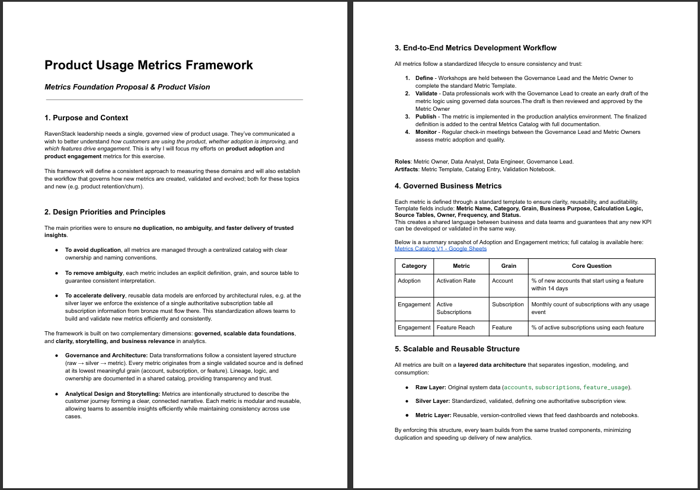
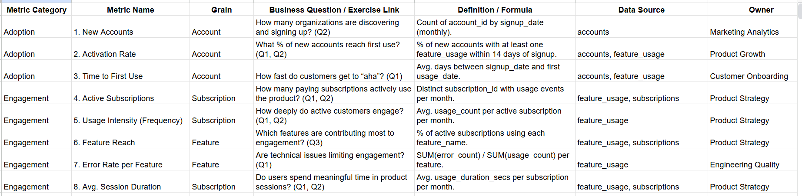
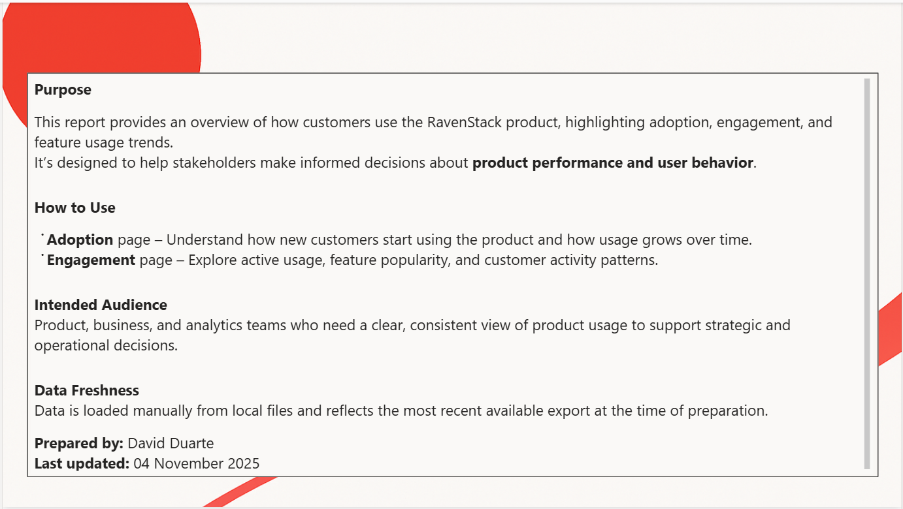
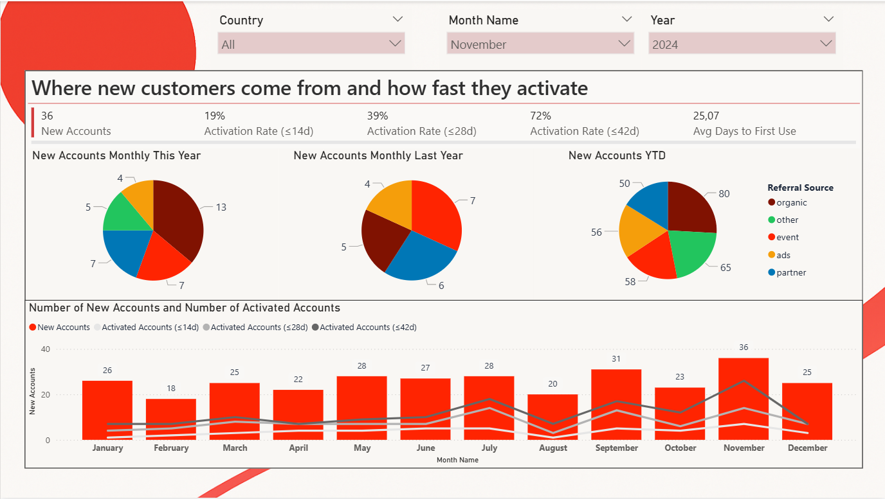
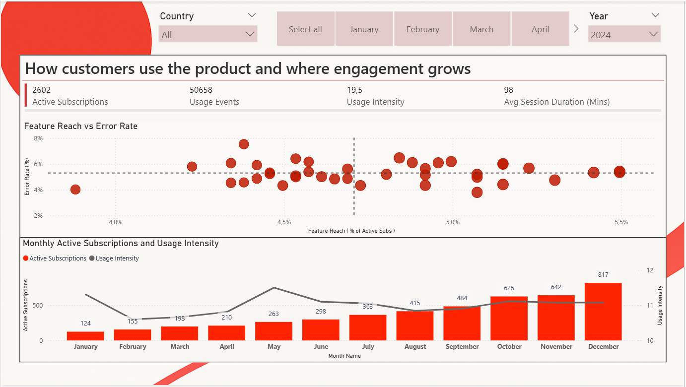

# RavenStack: SaaS Product Analytics & Governance Ecosystem

### A holistic approach to Product Intelligence: From raw data ingestion to governed, self-service insights.

## Project Vision & Overview
In the SaaS landscape, data volume is rarely the problem—data **trust** is. This project simulates a complete analytics solution for "RavenStack" (a B2B SaaS platform).

The goal was to move beyond ad-hoc reporting to build a **scalable data product**. This involves not just the technical execution (ETL, Data Modeling), but the **governance layer** that ensures metrics like *Active Usage* and *Churn* are defined, cataloged, and trusted across the organization.

### Core Objectives
* **Single Source of Truth:** Move from fragmented CSVs to a Star Schema (Gold Layer) model.
* **Governance-First Design:** Implement a "Metrics Development Lifecycle" to prevent definition drift.
* **Actionable Intelligence:** Deliver a Power BI experience focused on *Adoption* and *Engagement* rather than vanity metrics.

---

## 🛡️ Governance & Methodology

This solution prioritizes **Metric Consistency** over speed. To prevent the "report chaos" where different teams calculate KPIs differently, I designed a comprehensive Governance Framework that treats data as a product.

### 1. The Metrics Development Lifecycle
I defined a strict workflow to ensure no metric reaches the dashboard without validation. This moves the organization from "Wild West" reporting to a certified release process.

* **Define:** Governance Lead and Business Owner agree on the business question and "Grain" (aggregation level).
* **Validate:** Logic is tested against raw data; edge cases (e.g., churn vs. expiration) are documented.
* **Publish:** The metric is "Certified" in the catalog and pushed to the Gold Layer.

### 2. The Metrics Catalog
All KPIs are documented in a centralized dictionary. This is not just a list, but a functional tool for stakeholders to understand the "Why" and "How" behind every number.

* **Artifact:** [Metrics Catalog](metrics_docs/Metrics_Catalog.xlsx)
* **Strategic Value:** Connects technical calculation logic (SQL/DAX) with business ownership and value definitions.

### 3. Integrated Documentation
To bridge the gap between technical logic and business users, the Power BI report includes an embedded documentation page.

---

## Technical Architecture

The solution follows a Medallion Architecture (Bronze -> Silver -> Gold) implemented via Python notebooks, tailored for modularity and auditability.

| Layer | Status | Description |
| :--- | :--- | :--- |
| **Bronze** | Raw | Ingestion of raw CSVs (Accounts, Subscriptions, Feature Logs, Support Tickets). |
| **Silver** | Cleaned | **Transformation Logic:** Date standardization, referential integrity checks, and valid subscription window filtering. |
| **Gold** | Curated | **Dimensional Model:** Star schema designed for BI performance. Includes Fact_Subscription, Fact_Feature_Usage, and Conformed Dimensions (Dim_Account, Dim_Date). |

### Repository Structure

    ├── metrics_docs/
    │   ├── Governance_Framework_Guide.pdf  # The protocol for creating & certifying metrics
    │   └── Metrics_Catalog.xlsx            # The dictionary of business logic & owners
    ├── notebooks/
    │   ├── 01_Exploratory_Analysis.ipynb   # Data profiling & quality checks
    │   ├── 02_Transform_Silver_Accounts.ipynb    # Logic for cleaning accounts
    │   ├── 03_Transform_Silver_Features.ipynb    # Logic for cleaning usage data
    │   ├── 04_Model_Gold_Dimensions.ipynb  # Final star-schema assembly
    │   └── 99_Util_Date_Dimension.ipynb    # Dynamic calendar generation
    ├── img/                                # Screenshots for this README
    └── SaaS_Usage_Dashboard.pbix           # The final Power BI solution

---

## Analytics Solution (Power BI)

The front-end solution addresses two specific questions from Product Leadership: *"Are customers adopting the platform?"* and *"How deeply are they engaging?"*

### View 1: Product Adoption
Focuses on the onboarding funnel and monetization.
* **Key Insight:** Visualizes the conversion lag from Trial to Paid.
* **Use Case:** Helps Sales identify bottlenecks in the first 14 days of the customer journey.

### View 2: Feature Engagement
Focuses on retention and feature stickiness.
* **Key Insight:** Correlates high-value feature usage with lower churn probability.
* **Use Case:** Helps Product Managers prioritize roadmap decisions based on actual utility.

---

## Key Outcomes & "Enabler" Mindset
This project demonstrates that a Senior Data Analyst's role is to **enable others**.
1.  **Scalability:** By standardizing the `Gold` data layer, other teams (Marketing, Finance) can build their own reports without duplicating logic.
2.  **Trust:** The Governance Framework ensures that when two people say "Churn Rate," they mean the same thing.
3.  **Usability:** The dashboard design prioritizes clear business questions over complex data dumps.

---

*Note: The dataset used (RavenStack) is synthetic and generated for demonstration purposes.*